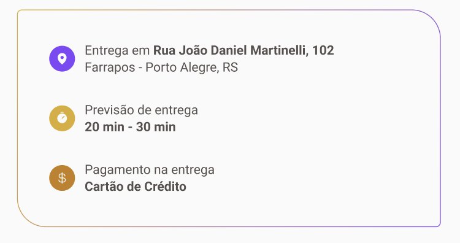

# Informações e Anotações Gerais do Projeto

- Inicialmente declarei todo o tema default do projeto, pois, como todas as páginas da aplicação tera o mesmo Header, podemos criar um defaultTheme para nos ajudar futuramente quando estivermos utilizando o react-router-dom, para fazer a trocas das pages dentro da aplicação.
- Criei uma pasta chamada styles e dentro dela criei outra chamada themes e um arquivo default.ts, aonde criei todas as estilizações que estarei utilizando neste padrão do projeto.
- Para isso, irei utilizar o styled-components
  - instalação:
    - npm i styled-components
    - npm i @types/styled-components -D
      - instalando como dependencia de desenvolvimento, pois, não precisamos das tipagens em produção,  
        porque em prod, nosso código, vai ser convertido totalmente em JS.

- ## Páginas e rotas

- inicialmente para trabalhar com as rotas, iremos utilizar no projeto a famosa biblioteca react-router e como trbalharemos com aplicações Web, iremos usar especificamente o react-router-dom
  - instalação: npm i react-router-dom

- BrowserRouter
  - Ao analisarmos a criação e importação de qualquer rota/page na nossa aplicação, veremos que no console, vai dar vários problemas inicialmente, desta forma, se analisarmos a [documentação do react-router](https://github.com/remix-run/react-router) e for no [getting-started](https://github.com/remix-run/react-router/blob/main/docs/start/_tutorial.md), veremos que a gente precisa importar o BrowserRouter do react-router-dom e realizar um wrap do nosso app dentro BrowserRouter 
  
- ## Layout de Rotas

  - No [Layout](https://www.figma.com/design/04M08yho8hDftlvH2lZAHP/Coffee-Delivery-•-Desafio-React-(Copy)?node-id=0-1&t=QVV9Jl6CAGgdrP3w-0) que temos hoje, podemos verificar que temos partes em comuns nas pages da aplicação e sendo assim, para simplesmente ter essa parte 'constante' nas pages(routes), podemos criar um component, como por exemplo, um Header que será uma parte constante na aplicação e o conteúdo realmente vindo logo na sequência e está questão de transição por exemplo entre routes(pages), podemos fazer com base na utilização do component Outlet que vem de dentro do react-router-dom, que é nada mais que um espaço ao qual será inserido um conteúdo, ou seja, o conteúdo presente dentro de cada rota.

  - Ao usarmos a seguinte configuração dentro do arquivo Routes.tsx

    >
        <Route path="/" element={<DefaultLayout />}>
          <Route path="/" element={<HomePage />} />\
          <Route path="/CompleteOrder" element={<CompleteOrderPage />} />
        </Route>

    - Conseguimos entender que as duas rotas ali presente (HomePage e CompleteOrderPage), estarão utilizando o layout que foi colocado por volta, através da outra tag Routes que envolveu as duas, como mostrado acima.

## Ícones utilizados no projeto

- [Phosphor React Icons](https://www.npmjs.com/package/phosphor-react)
  - Phosphor é conhecido por ser uma família de ícones bem flexível para interfaces, diagramas, apresentações e 
    o que mais for necessário. Para visualizar os ícones existentes, basta acessar: phosphoricons.com

  - Após criarmos nosso HeaderButton, será preciso fazer a estilização com relação as cores e os ícones importados e isso, podemos ver a seguir:

    >
        import { MapPin, ShoppingCart } from 'phosphor-react'
        ...

        //cada button foi acionado e passado como parametro um tamanho e uma 'grossura'
        <HeaderButtonContainer>
          <HeaderButton variant="purple">
            <MapPin size={20} weight="fill" />
            Porto Alegre, RS
          </HeaderButton>
          <HeaderButton variant="yellow">
            <ShoppingCart size={20} weight="fill" />
          </HeaderButton>
        </HeaderButtonContainer>

- Na estilização fizemos o seguinte, para 'pegar' a cor de maneira dinâmica:

    >
        ${({ variant, theme }) => css`
          background: ${theme.colors[`brand-${variant}-light`]};
          color: ${theme.colors[`brand-${variant}-dark`]};
        `}

        ${({ variant, theme }) =>
          variant === 'purple' &&
          css`
            svg {
              color: ${theme.colors['brand-purple']};
            }
          `}

- Na estruturação do nosso componente de InfoWithoutIcon, utilizamos para tipagem o ReactNode
  - ReactNode é uma biblioteca JS para construção de interfaces de usuário
    e também é conhecido por ser uma abstração que representa qualquer
    elemento que pode ser renderizado pelo React, incluindo elemento JSX, strings,números, arrays e framents.
    O ReactNode é usado para representar esses elementos
    de forma genérica, permitindo que você os manipule
    de maneira flexível em seus componentes.

## Page OrdeerConfirmed

- para aplicarmos a bordar arredondada com gradiente como analisado no design(imagem a seguir), teremos que aplicar o hack do css

- O Hack do css é o seguinte, teremos que usar o before para a div que estamos trabalhando no local:

  * Para a border-radius funcionar neste elemento, iremos aplicar os mesmos valores refinidos acima do before, porém, incrementando em cada um o valor da grossura estabelecido.
    
      >
        &::before {
          content: "";
          position: abolsute;
          inset: -1px;
          border-radius: 0.4375rem 2.3125rem 0.4375rem 2.3125rem;
          background: linear-gradient(102.89deg, #dbac2c 2.61%, #8047f8 98.76%);
        }

  * O inset de -1px, ele corresponde ao valor de menos o valor desejado, ou seja, se a border-width ou a grossura da borda for maior, teriamos que 'aumentar', mas como a largura no design é 1px, so colocaremos -1

## Partindo para o backend

### Utilizando immer
    - Nesta parte estaremos aprendendo sobre o immer e aplicando esse biblioteca dentro do projeto
    - O immer é uma biblioteca como mencionado acima, que usamos para trabalhar com dados imutáveis, ou seja, que trabalha com conceito de imutabilidade, que é algo que bem trabalhado dentro do react
    - Repo
        - https://github.com/immerjs/immer

    * instalação
        - npm i immer
        