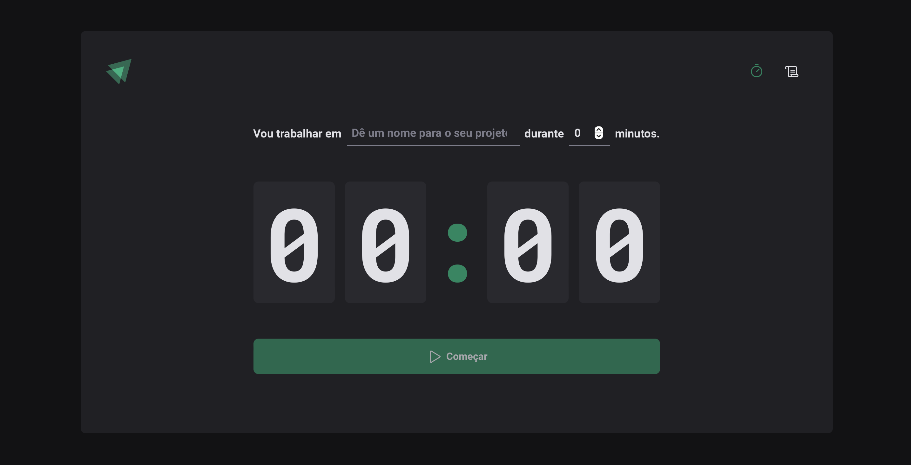
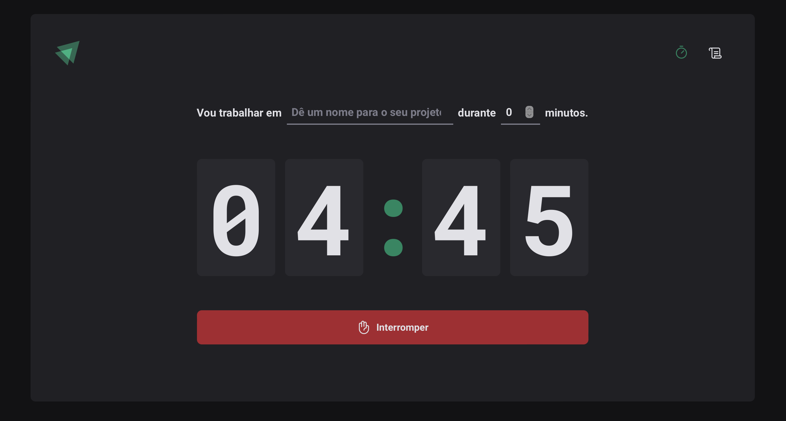
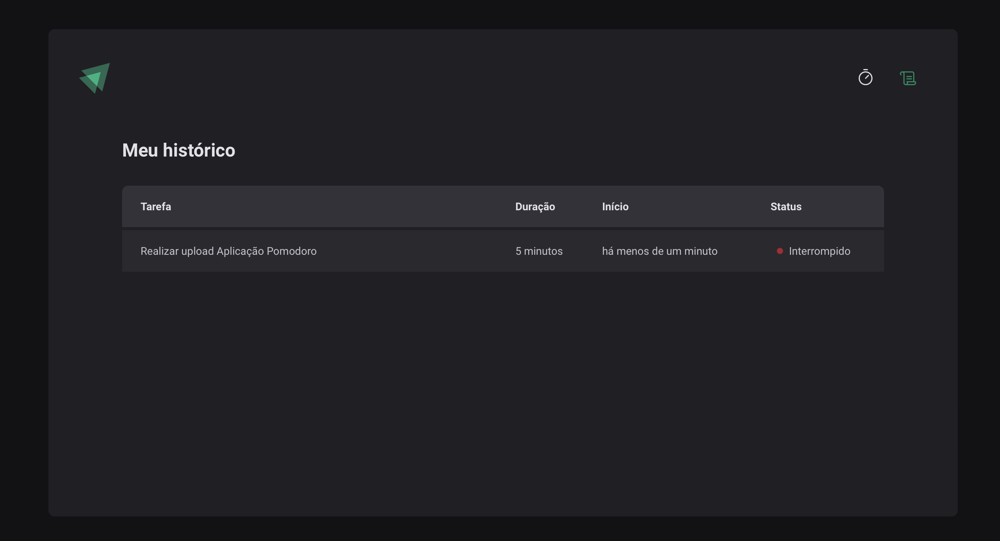

# Projeto Timer (Pomodoro) Ignite
- Neste projeto, vamos utilizar o Styled Components (https://styled-components.com/),
para criar as estilizações da nossa aplicação
- O Styled Components é uma biblioteca de CSS-in-JS, ou seja, é uma biblioteca que permite 
utilizar o CSS dentro do JavaScript e em um formato parecido com os do React, adicionando muitas 
funcionalidades à aplicação.

- Passos iniciais:
  - Configurar Styled Components
  - Principais conceitos
  - Estruturar toda a estilização da aplicação

## Preview application
* Tela inicial

* Timer em andamento

* Histórico de timers

## [Figma Project](https://www.figma.com/design/EsR4Ok8WCICCfWjyFIt3Yn/Ignite-Timer-(Community)?node-id=0-1&t=pydSwYlsK1vKJ4HD-0)

## [Assets Project](https://www.figma.com/design/ELte8mBmDArgUI3z3IxNwW/Ignite-Timer-(Community)?node-id=313-964&t=PQkB3aBu26wW0jf7-0)

## ESLint Config Rocket
  - [Configurações padrões](https://github.com/Rocketseat/eslint-config-rocketseat/blob/main/react.js) criadas pela rocket para padronizar toda a aplicação do Timer Pomodoro