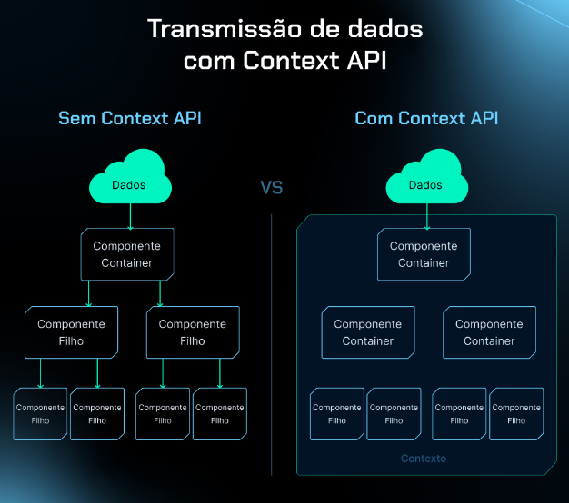

# Infos e Anotações Gerais do Projeto

- ## Styled Components
    - Maneira de estilizar as nossas aplicações em React, utilizando um conceito chamado CSS in JS
        - CSS in JS, como o próprio nome já diz, iremos escrever o CSS da nossa aplicação no formato ou sitaxe
        da linguagem JS.
    - Como estamos utilizando o TS, o styled components, é um daqueles pacotes que ele não traz consigo as tipagens.
    - As declarações de tipagens deste pacote, elas ficam em um pacote separado, que seria o @types/styled-components
    - Styled components, basicamente são abstrações de CSS, ou seja, estilizações

        - Declarando uma constante, iniciando com letra em caixa alta, pois, é um componente.
        - Como esse button vai ser um componente estilizado, eu preciso sinalizar qual elemento HTML ele será e faremos isso da seguinte forma:
            - Como iremos fazer um button, então, importamos o próprio button do html
            - Para adicionar o CSS, iremos utilizar Template-literals, que é nada mais que ``, logo após o styled.button.

            >
                export const ButtonContainer = styled.button`
                    width: 100px;
                    height: 40px;
                `

    - Ao realizarmos uma interpolação, ou seja, incluir um código JS dentro de uma string 'maior', que é o que esta sinalizado pelas ``, dentro da criação do nosso button de exemplo, o styled-components irá executar como uma função e este vai enviar pra a função todas as propriedades do meu ButtonContainer, como podemos verificar logo abaixo:

        > 
            <ButtonContainer variant={variant}>
                Enviar
            </ButtonContainer>

    - As propriedades serão acessadas da seguinte forma:

        >
            ${ props => {
                return `background-color: ${buttonVariant[props.variant]}`
            } }

- ## Instalação
    - npm i @types/styled-components -D
    - instalando como dependencia de desenvolvimento, pois, não precisamos das tipagens em produção, 
    porque em prod, nosso código, vai ser convertido totalmente em JS

- ## Configuração/Gestão de temas ( Styled Components)
    - É possível ter quantos temas julgarmos necessário
    - Os temas são controlados por JS
    - Equivale as variáveis criadas no css puro

- ## Tipagem de temas
    - Quando usamos TS em meus projetos, eu tenho a possibilidade de criar arquivos de tipagem especificos minha aplicação, ou seja, customizados.

    - Criação de uma pasta @types
        - arquivo styled.d.ts
            - mas porque o d.ts?
                - Significa que eu so vou ter código de definição de tipos do TS e nunca código JS ou qualquer coisa assim.

    - typeof => Função específica do TS (type operator)

    - declare module => modo de criar uma tipagem para o modulo que esta sendo utilizado no momento
        - Isso irá inferir no momento em que importarmos o modulo em algum arquivo, a tipagem que será 'puxada', será a que for definida dentro do escopo em questão

- ## Global Styles

    - No style-components, os estilos globais serão com sintaxe JS e não CSS
    - inicialmente usamos função própria do style-components, chamada createGlobalStyle e apartir dela conseguimos definir todo o escopo de estilização mais global da nossa aplicação

- ## Configurando o ESLint
    - ESLint => EcmaScript Linting
        - Linting => Processo para validar que teu código segue padrões estipulados pelos criadores do projeto em si.

     - Instalação
        - npm i eslint -D

        - pacote especifico do eslint, orientado e criado pela rocketseat
            - npm i @rocketseat/eslint-config -D
                - esse pacote ele traz alguns padrões de escrita de código para JS e claro que pode ser criado o próprio padrão, mas hoje estaremos utilizando este padrão criado pela escola.

        - para criação de configs pessoais:
            - npx eslint --init
            - responder as perguntas feitas pelo vscode e assim, será criado sua própria config do eslint e ficando assim um padrão próprio do seu projeto.

        - criando arquivo eslintrc.json, para aplicar um extends com o nome do pacote e como o pacote da rocket, tem diversas configs, iremos pegar a própria do react:
            >
                {
                    "extends": "@rocketseat/eslint-config/react"
                }

        - Para testar:
            - rodar no terminal: 
                - npx eslint src --ext .ts,.tsx
                    - src: pasta aonde esta os arquivos
                    - --ext: a extensão dos arquivos que será verificado os erros
                    - logo mem seguida adicionar as extensões

        - Para corrigir os erros de maneira geral:
            - rodar o mesmo comando acima, porém, com --fix adicionado ao final do comando:
                - npx eslint src --ext .ts,.tsx --fix

- ## Páginas e rotas
    - React Router Dom

        - inicialmente para trabalhar com as rotas, iremos utilizar no projeto a famosa biblioteca react-router e como trbalharemos com aplicações Web, iremos usar especificamente o react-router-dom

        - instalação:
            - npm i react-router-dom

    - BrowserRouter
        - Ao analisarmos a criação e importação de qualquer rota/page na nossa aplicação, veremos que no console, vai dar vários problemas inicialmente, desta forma, se analisarmos a [documentação do react-router](https://github.com/remix-run/react-router) e for no [getting-started](https://github.com/remix-run/react-router/blob/main/docs/start/_tutorial.md), veremos que a gente precisa importar o BrowserRouter do react-router-dom e realizar um wrap do nosso app dentro BrowserRouter 

    - Contexts-Providers
        - São components que basicamente não tem efeito visual nenhum, mas eles produzem um contexto para os components que estão dentro deles, ou seja, informações para estes components saberem do contexto de 'fora' ou digamos do mundo externo, para que estes obtenham informações do que eles já possuem 'naturalmente' ao serem criados

- ## Layout de Rotas

    - No [Layout](https://www.figma.com/design/ELte8mBmDArgUI3z3IxNwW/Ignite-Timer-(Community)?node-id=313-1874&t=PQkB3aBu26wW0jf7-0) que temos hoje, podemos verificar que temos partes em comuns nas pages da aplicação e sendo assim, para simplesmente ter essa parte 'constante' nas pages(routes), podemos criar um component, como por exemplo, um Header que será uma parte constante na aplicação e o conteúdo realmente vindo logo na sequência e está questão de transição por exemplo entre routes(pages), podemos fazer com base na utilização do component Outlet que vem de dentro do react-router-dom, que é nada mais que um espaço ao qual será inserido um conteúdo.

    - Dentro do react-router-dom, temos um component chamado NavLink e este nos auxiliará na hora da transição entre as rotas, este será utilizado no lugar das ancoras que estavamos utilizando no inicio do projeto.

        >
            <HeaderContainer>
                
                <nav>
                    <a href="">
                        <Timer size={24} />
                    </a>
                    <a href="">
                        <Scroll size={24} />
                    </a>
                </nav>
            </HeaderContainer>

        >
            <HeaderContainer>
                
                <nav>
                    <NavLink to="">
                        <Timer size={24} />
                    </NavLink>
                    <NavLink to="">
                        <Scroll size={24} />
                    </NavLink>
                </nav>
            </HeaderContainer>

        - obs.: Na ancora usamos a propriedade href, já no NavLink usamos o to

- ## Aprimorando Inputs
    - Elemento HTML datalist
        - Lista de sugestões para um input

- ## Página: History
    - Em aplicações mobile não existe uma forma de representar uma tabela de forma satisfatoria, por isso na aplicação envolvemos a tabela com uma div e quando for acessado em um dispositivo mobile e a tela estiver menor, será feito com que o usuário final consiga dar scroll na tabela, ou seja, consiga arrastar de um lado para o outro na tela, vendo assim a tabela como um todo.
    - Overflow: auto
        - Faz com que  se o tamanho da tabela, for maior do que o cantainer que ela esta inserida, gere automaticamente uma barra de rolagem 

    - border-collapse: collapse

- ## Status (Component)
    - Nosso component de status na aplicação, com base no styled-component, não precisa necessariamente ser um arquivo separado, so porque ele é visualmente diferente e sim pode ser somente um elemento estilizado, 

- ## Controlled vs Uncontrolled
    - Controlled
        - Manter em tempo real a informação que o usuário insere na nossa aplicação, dentro do state/variavel dentro do componente
        - Traz uma certa 'fluides' na interface
        - Toda vez que realizamos uma atualização de estado, acabamos provocando uma nova renderização, ou seja, recalcula todo o conteúdo do component do estado que foi alterado e esse recalcular todo o conteúdo do component, não necessariamente é lento, mas ao termos interfaces muito complexas , com bastante informação, isso pode resultar em um gargalo

    - Uncontrolled
        - Busca a informação do valor do input, somente quando precisarmos dela.
        - São por exemplo quando termos formulários com uma quantidade bem grande de inputs, e se caso fosse de modo controlled, imagina a cada interação com o input, a aplicação realizar a renderização da tela novamente, ficaria excessivamente lento, desta forma, fica mais viável utilizar o uncontrolled.

        > 

            export function main() {
                function handleSubmit(event) {
                    event.target.task.value
                }

                return (
                    <HomeContainer>
                        <form onSubmit={handleSubmit} action="">
                        <FormContainer>
                            <label htmlFor="task">Vou trabalhar em</label>
                            <taskInput
                                id="task"
                                name="task"
                                list="task-suggestions"
                                placeholder="Dê um nome para o seu projeto"
                            />

                            ....

                        </FormContainer>
                    </HomeContainer>
                )
            }

        - Porém, ao utilizarmos o uncontrolled, perdemos a fluidez, pois, não teremos mais acesso ao valor inserido no input letra a letra e ai não temos mais como trabalhar por exemplo com ativação ou desativação de algum component, mas ganhamos em performance, então essa decisão é tomada em momentos.
            - Controlled
                - Formulários simples, com poucos campos, com interface simples, como por exemplo formulário de login, de cadastro.
            - Uncontrolled
                - Formulário aonde não monitoramos o valor digitado em tempo real, como dashboards/painéis de cadastro de jornada/trilhas contendo aulas, informações de módulos e etc.
            

- ## React Hook Form
    - Biblioteca de formulários
        - trabalha tanto de uma maneira controlled quanto uncontrolled, ou seja, conseguimos trabalhar com performance sem abrir mão da flexibilidade, da fluidez, da interatividade com os campos do nosso formulário

    - Hooks do React
        - Funções dentro do react que utilizam do prefixo use, aonde ela acomplam uma funcionalidade em um component existente

    - Instalação
        - npm i react-hook-form

    - useForm
        - Função aonde retorna um objeto, para criação do form
        - Quando usamos o useForm, é como se eu estivesse criando um novo formulário na minha aplicação

    - Função register
        - retorno desta função são alguns métodos, que são os métodos que utilizamos para trabalhar com inputs no JS, então, como exemplo, podem ser devolvidos funções como onChange, onBlur, onFocus...
        - método para adicionar um input ao nosso formulário
        - 'quais campos eu vou ter no meu formulário'

        >
            function register(name: string) {
                return (
                    onChange: () => void,
                    onBlur: () => void,
                    onFocus: () => void,
                )
            }

    - Função handleSubmit
        - 

    - Função watch
        - Função aonde estaremos observando por exemplo o campo task(campo registrado dentro do register) e desta forma saberemos o valor, do meu campo em tempo real
        - Se o campo de task for diferente de vazio, iremos habilitar o button 

- ## Validando formulário
    - Por padrão o react-hook-form não traz nada de validação, pois ela é considerada uma biblioteca mais enxuta, aonde ela tem menos funcionalidades e utiliza de outras bibliotecas feitas propriamente para validação e que são muito boas nesse quesito, ficarem integradas a ele e não ter que criar toda uma estrutura de validação junto na biblioteca, sabendo que existem bibliotecas feitas somente para isso.

    Bibliotecas para validação:
    * [Yup](https://github.com/jquense/yup)
        - Instalação --> npm i yup
    * [Joi](https://github.com/hapijs/joi)
        - Instalação --> npm i joi
    * [Zod](https://github.com/colinhacks/zod)
        - Instalação --> npm i zod

    - para que a integração do react-hook-form funcione com essas bibliotecas, é necessário instalar outra biblioteca chamada @hookform/resolvers, ela permite a integração do react-hook-form com as libs de validação

    - Ao importarmos a lib do zod na nossa aplicação, veremos que da um pequeno problema ao realizarmos da seguinte forma: import zod from 'zod', pois, a lib do zod não tem um export default, por isso, a importação é realizado da seguinte forma, conforme uma técnica do EcmaScript: import * as zod from 'zod'

    - Para visualizar os erros de validação, podemos utilizar o formState que está presente dentro do useForm e de dentro do formState, existe uma variável chamada errors

    - Aqui vale relembrar que nunca podemos utilizar uma variável JS, como o exemplo a seguir, dentro do TS, o próprio não conseguiria entender
        >
            const newCycleFormValidationSchema = zod.object({
                task: zod.string().min(1, 'Informe a tarefa!'),
                minutesAmount: zod.number()
                    .min(5, 'O ciclo precisa ser de no mínimo 5 minutos.')
                    .max(60, 'O ciclo precisa ser de no máximo 60 minutos.'),
            })

        - desta forma, é preciso converter a variável JS em uma tipagem, em algo específico do TS e para isso, usamos sempre o typeof

            >
                type NewCycleFormData = zod.infer<typeof newCycleFormValidationSchema>

- ## Resetando formulário
    - Dentro do useForm existe uma função chamada reset() e chamamos essa função dentro da nossa função de submit da aplicação, que automaticamente vai limpar os campos do formulário para o valor original
    - O reset funciona voltando os campos do formulário, para os valores que estão dentro do defaultValues e se caso esquecer de registrar qualquer campos dentro do defaultValues, ele não será retornado ao seu valor original

- ## Iniciando novo ciclo
    - Na aplicação hoje nos temos um ciclo ativo por momento
    - Sendo assim, temos duas formas de controlar qual o ciclo que está ativo no momento:
        1. Adicionando um parametro boolean, para mostrar se o ciclo está ativo ou não
            > 
                interface Cycle {
                    id: string
                    task: string
                    minutesAmount: number
                    isActive: boolean
                }

            - Mas temos um problema com relação a esta forma, que é quando colocamos um novo ciclo como ativo, teremos que percorrer os outros ciclos até, eu conseguir achar qual que era que estava ativo antes, para colocar o isActive como False, ou seja, toda a vez que 'startar' um novo ciclo (colocando como ativo), terei que mudar um outro ciclo que já estava ativo para falso, resultando assim em duas modificações no mínimo, para conseguir retornar o novo ciclo como ativo.

        2. Manter um estado como o id do ciclo que esta ativo, que pode ser uma string ou nulo, iniciando como nulo

            >
                const [activeCycleId, setActiveCycleId] = useState<string | null>(null)

            * aplicar o estado dentro da nossa função de criação de novo ciclo

                >
                    function handleCreateNewCycle(data: NewCycleFormData) {

                        const id = String(new Date().getTime())

                        const  newCycle: Cycle = {
                            id,
                            task: data.task,
                            minutesAmount: data.minutesAmount,
                        }

                        setCycles((state) => [...state, newCycle]);
                        setActiveCycleId(id)

                        reset()
                    }

- ## Criando countdown
    - Armazenando o total de segundos
        >
            const totalSeconds = activeCycle ? activeCycle.minutesAmount * 60 : 0

    - Armazenando a quantidade de segundos 'current'
        >
            const currentSeconds = activeCycle ? totalSeconds - amountSecondsPassed : 0

    - Armazenando o valor dos minutos, caso aconteça de retornar um valor 'quebrado' como o resultado da divisão
        - Através do Math.floor, conseguimos corrigir essa questão, pois realizamos o arredondamento do valor

        >
            const minutesAmount = Math.floor(currentSeconds / 60)

    - Armazenando os segundos que retornam do resto da divisão do currentSeconds por 60

        >
            const secondsAmount = currentSeconds % 60

    - Função padStart
        - Método para preenche a string original com um determinado caractere, ou conjunto de caracteres(várias vezes, se necessário) até que a string resultante atinja o comprimento fornecido.

        >
            const minutes = String(minutesAmount).padStart(2,'0')
            const seconds = String(secondsAmount).padStart(2,'0')

    - Apresentando os valores em tela

        > 
            <CountDownContainer>
                {minutes[0]}
                {minutes[1]}
                <Separator>:</Separator>
                {seconds[0]}
                {seconds[1]}
            </CountDownContainer>

- ## O hook useEffect
    - useEffect
        - use -> hooks
        - Effect -> Side-effect | Efeito Colateral
            - será uma ação que vai ser desencadeada por causa de uma ação anterior

            - Permite ficar monitorando mudanças em uma varíavel e toda a vez que essa varíavel mudar, independente de qual o motivo, qual a origem, quem alterou essa varíavel, seja disparado uma função para trabalhar nessa questão

            - useEffect, recebe dois parâmetros:
                1. Qual função que vai ser executada
                2. Quando que a mesma vai ser executada, ou seja, será um array, basicamente passando a varíavel que vai ser monitorada

                >
                    useEffect(() => {}, [])

            - Com o useEffect(), podemos falar exatamente quais varíaveis eu quero monitorar
            - O useEffect executa em um primeiro momento, no ínicio, assim que o component em que ele se encontra for exibido em tela por exemplo.
            - E em um segundo momento, toda a vez que uma das varíaveis que passamos no array de dependências, for alterada ou mudada, porém, quando não passamos nada nesse array, ele será executado uma única vez, que é quando o component aparecer em tela
                - Executando uma única vez e trazendo os repos da minha page do git
                >
                    useEffect(() => {
                        fetch('https://github.com/users/BManduca/repos')
                        .then(response => response.json())
                        .then(data => {
                            setList(data.map((item:any) => item.full_name))
                        })
                    }, [])

            - Ponto importante: Dificilmente utilizamos o useEffect para realizar a atualização de um estado

- ## Reduzindo o countdown
    - Package date-fns
        - install: npm i date-fns
        - importar differenceInSeconds

        - differenceInSeconds
            - Calcula a diferença em duas datas em segundos, para a fazer a geração do setAmountSecondsPassed
            - recebe como parâmetros(tomando como exemplo a aplicação que estamos construindo):
                - passamos como primeiro param a data atual (new Date())
                - passamos como segundo param, a data que foi dado o start no cycle atual (activeCycle.startDate)

- ## Mudando title da página
    - Curiosidade: de Dentro do useEffect podemos ter um retorno e esse retorno sempre será uma função
        - essa função ela tem uma responsabilidade, que é para quando o useEffect for executado novamente, porque houve alguma mudança nas varíaveis que estão sendo monitoradas (depedências), como por exemplo resetar ou 'limpar' o efeito do useEffect anterior, ao iniciar um newCycle

- ## Interromper Ciclo
    - Ao iniciarmos um ciclo, seria interessante que o button trocasse de verde para uma cor por exemplo vermelha e que o texto fosse de Começar para interromper, desta forma, essa ação pode ser feita da seguinte forma:

        * Através de condicional ternário
            > 
                { activeCycle ? (
                    <StopCountdownButton type="button">
                        <HandPalm size={24} />
                        Interromper
                    </StopCountdownButton>
                    ) : (
                    <StartCountdownButton disabled={isSubmitDisabled} type="submit">
                        <Play size={24} />
                        Começar
                    </StartCountdownButton>
                    ) 
                }

            * Aonde caso o ciclo esteja ativo, será 'mostrado' um button para interromper o processo e caso contrário, será mostrado o button inicial para começar um novo ciclo

            * Para 'agilizar' e deixar mais simples o processo de estilização, podemos pegar a estilziação que já existia para o StartCountdownButton e transformar em um BaseCountdownButton:

                >
                    export const BaseCountdownButton = styled.button`
                        width: 100%;
                        border: 0;
                        padding: 1rem;
                        border-radius: 8px;

                        display: flex;
                        align-items: center;
                        justify-content: center;

                        gap: 0.5rem;
                        font-weight: bold;

                        cursor: pointer;

                        color: ${(props) => props.theme['gray-100']};

                        &:disabled {
                            opacity: 0.7;
                            cursor: not-allowed;
                        }
                        
                    `

            * Em seguida, criamos estilizações para cada tipo de button existente:

                - StartCountdownButton
                    >
                        export const StartCountdownButton = styled(BaseCountdownButton)`
                            background: ${(props) => props.theme['green-500']};

                            &:not(:disabled):hover {
                                background: ${(props) => props.theme['green-700']};
                            }
                        `

                - StopCountdownButton
                    >
                        export const StopCountdownButton = styled(BaseCountdownButton)`
                            background: ${(props) => props.theme['red-500']};

                            &:not(:disabled):hover {
                                background: ${(props) => props.theme['red-700']};
                            }
                        `

    - Para deixar inativo os campos de input, enquanto um ciclo estiver ativo, podemos utilizar o disabled, passando o activeCycle, com uma validação booleana

        >
            disabled={!!activeCycle}

        
        * o !! significa validação booleana

    - Adicionando o campo interruptedDate como campo opcional na interface Cycle e Criando uma função para interromper o Ciclo ativo:

        > 
            interface Cycle {
                id: string;
                task: string;
                minutesAmount: number;
                startDate: Date;
                interruptedDate?: Date;
            }

        > 
            function handleInterruptCycle() {

                setCycles(cycles.map(cycle => {
                if (cycle.id === activeCycleId) {
                    return {
                    ...cycle,
                    interruptedDate: new Date()
                    }
                } else {
                    return cycle;
                }
                }))

                setActiveCycleId(null);

            }

    - No react é bom lembrar que nunca podemos alterar uma informação sem seguir os princípios da imutabilidade 

- ## Separando components

    - Há dois grande momentos e duas formas de repartir componentes, transformando assim componentes maiores em componentes menores 

        1. Primeira forma é quando percebemos que algum componente está sendo utilizado muitas vezes dentro da sua aplicação

        2. Outro momento é quando percebemos que tem partes de um componente maior que elas podem funcionar sozinhas sem depender do restante  

- ## Prop Drilling no React
    - Prop Drilling Quando a gente tem muitas propriedades APENAS para comunicação entre componentes

    - Para contornar este problema no react, temos um conceito no react chamado Context API
        - o Context API permite compartilhar informações entre vários components ao mesmo tempo
        - a Context API não precisa utilizar de propriedades
        - É como se fossem informações globais e que todos os componentes podem ter acesso, todos os componentes podem modificar as informações e quando modificas, indepentende de quem modificou as informações, todos os componentes que dependendiam e dependem dessas informações são atualizados.   

- ## Entendendo contextos

    - Context API
        - No react é trabalhoso passar os dados entre componentes, especialmente em aplicações maiores.
        - A Context API é uma solução nativa do React para esse desafio. Em vez de enviar informações através de múltiplos níveis de componentes, você cria um "contexto" que disponibiliza esses dados para qualquer componentes que queira "escutá-los"

        

        - Context API se destaca por ser integrada diretamente ao React, trazendo menos dependências e uma curva de aprendizado mais 'amigável'

        - O TypeScript nos ajuda a entender e garantir que os tipos (as propriedades) dos nossos dados estejam corretos e com ele podemos evitar bugs.
        - Context API ajuda a gerenciar dados e o TypeScript garante que o formato desses dados estejam certos

- ## Convertendo para contextos

    - Exemplo de funcionalidade do Context API
        - nossa função markCurrentCycleAsFinished, foi definida no component Home, porque ela usa da função setCycles, que so existe dentro do componente Home e em seguida enviamos essa função dentro do contexto, assim todos os componentes que estão dentro deste contexto, tem acesso a ela e quando o componente Countdown, chama a dunção markCurrentCycleAsFinished, na verdade ele ta chamando a função que foi definida la no componente Home, que vai alterar o estado de ciclos

            * Estado de ciclos

                >
                    const [ cycles, setCycles ] = useState<Cycle[]>([])

            * Função markCurrentCycleAsFinished no component Home

                >
                    function markCurrentCycleAsFinished() {
                        setCycles((state) => 
                        state.map(cycle => {
                            if (cycle.id === activeCycleId) {
                            return {
                                ...cycle,
                                finishedDate: new Date()
                            }
                            } else {
                            return cycle
                            }
                        })
                        )
                    }

            * Definição do context no component Home

                >
                    interface CyclesContextType {
                        //informações que serão guardadas dentro do contexto
                        activeCycle: Cycle | undefined
                        activeCycleId: string | null
                        markCurrentCycleAsFinished: () => void
                    }

            * Adição do markCurrentCycleAsFinished dentro da criação de um objeto dentro do component Countdown, sendo do tipo useContext(CyclesContext)

                >
                    const { activeCycle, activeCycleId, markCurrentCycleAsFinished } = useContext(CyclesContext)

            * Realizada a chamada da const markCurrentCycleAsFinished, dentro do useEffect e passa o mesmo para ficar sendo observado quando for atualizado como as contantes que já se encontram lá presente 

                >
                    useEffect(() => {
                        /* 
                        é preciso definir o interval como number, pois o JS defini o 
                        interval como um id ou uma referência para deletar posteriormente
                        */
                        let interval: number;

                        if (activeCycle) {
                        interval = setInterval(() => {

                            const secondsDifference = differenceInSeconds(
                            new Date(),
                            activeCycle.startDate
                            )
                            /*
                            Se o total de segundos que já foi percorrido já foi igual
                            ou maior que o número de tempo que o ciclo tem, vai ser marcado como completo
                            */

                            if (secondsDifference >= totalSeconds) {
                            markCurrentCycleAsFinished()
                            setAmountSecondsPassed(totalSeconds)
                            clearInterval(interval)
                            } else {
                            /*
                                e se caso ainda não foi completado, ou seja, não chegou a zero, 
                                irei continuar abaixando a quantidade de segundos
                            */
                            setAmountSecondsPassed(secondsDifference)
                            }

                        }, 1000)
                        }

                        return () => {
                        clearInterval(interval)
                        }

                    }, [activeCycle, totalSeconds, activeCycleId, markCurrentCycleAsFinished])

- ## Contexto no formulário

    - No react-hook-form ele oferece um contexto próprio, ao qual podemos utilizar, desta forma, em vez de utilizar de forma desestruturada, conforme a seguir:

        >
            const { register, handleSubmit, watch, reset } = useForm<NewCycleFormData>({
                resolver: zodResolver(newCycleFormValidationSchema),
                    defaultValues: {
                    task: '',
                    minutesAmount: 0,
                }
            })

    - usaremos da seguinte forma 

        >
            const newCycleForm = useForm<NewCycleFormData>({
                resolver: zodResolver(newCycleFormValidationSchema),
                    defaultValues: {
                    task: '',
                    minutesAmount: 0,
                }
            })

    - Como iremos precisar das seguintes funções: reset(), watch() e handleSubmit(), faremos a desestruturação, logo em seguida:

        >
            const { handleSubmit, watch, reset } = newCycleForm

    - Agora, por volta do componente NewCycleForm, colocamos o FormProvider e aplicamos um spread, onde pegamos basicamente cada uma das propriedades desse objeto newCycleForm e passamos como propriedade pro FormProvider:

        >
            <FormProvider {...newCycleForm}>
                <NewCycleForm />
            </FormProvider>

    - Criando o context no NewCycleForm (index.tsx), passando o register:

        >
            const { register } = useFormContext()

        - Lembrando que o useFormContext(), so funciona se tiver um provider por volta do componente, que esta usando o useFormContext

    - Lembrete:
        - A forma principal de comunicação entre componentes no React é por propriedades, só iremos para a questão de contexto quando sentimos que teremos muitas propriedades para enviar de um componente à outro e isso acaba tornando nosso código muito complexo

- ## Reducers

    ### Criando reducer de ciclos
    - Reducer serve para armazenar uma informação, assim como fazemos com as informações de ciclos e alterar essa informação no futuro

    - ao trocarmos a linha de código a seguir:
        1. const [cycles, setCycles] = useState<Cycle[]>([]) 
    - por: 
        2. const [cycles, setCycles] = useReducer((state, action) => {}, [])

        - para o reducer é passado dois params, aonde o primeiro é uma função e o segundo um array
        - No primeiro param, passamos também mais dois parâmetros, que seriam o state e o action
            - state: seria o valor atual em tempo real da nossa varíavel de ciclos
            - action: qual ação o usuário esta querendo realizar de alteração dentro da nossa varíavel, des forma, a action vai ser algo único digamos assim, para indicar uma ação que o usário está querendo realizar, para alterar o estado existente

    - Dentro do useReducer, temos uma função que vai agregar, digamos assim, ser a função que recebe todas as ações de modificações neste estado, então se eu querer adicionar um novo item, interromper um ciclo, marcar como finalizado...Teremos um ponto central para todas as alterações que precisam acontecer e podemos identificar cada uma dessas ações, ou seja, dintiguimos cada uma delas através do type que enviamos dentro do dispatche ai podemos realizar qualquer alteração que eu queira nesse estado

    - Lembrando que o retorno que fazemos desta função:

        >
            const [cycles, dispatch] = useReducer((state: Cycle[], action: any) => {
                if (action.type === 'ADD_NEW_CYCLE') {
                return [...state, action.payload.newCycle]
                }
                return state
            }, [])

        - Será o novo valor que este estado vai receber sempre que uma action for disparada

        - Nem sempre iremos utilizar o useReducer, iremos utilizar ele mais nessas situações em que temos um estado complexo, que armazena informações complexas dentro de um estado e essas informações elas precisam mudar constantemente com alterações provindas de várias fontes diferentes, de vários componentes diferentes...

    ### Salvando um objeto no reducer
    - Quando usamos reducer, não temos a obrigatoriedade de salvar somente uma informação, digamos somente a lista de ciclos, podemos salvar várias informações ali dentro, manter e alterar várias informações.

    ### Separando Action Types
    - Enum: Dicionário que diz para a gente exatamente quais as ações que a gente tem e quando em algum lugar do código a gente for realizar um dispatch por exemplo e não lembrar dos types, basta digitar a nomenclatura usada, como por exemplo ActionTypes, que usamos no nosso exemplo da aplicação e ao dar um autocomplete, já irão aparecer todos as opções.

    ### Separando Actions
    - Por uma questão de organização e manutenabilidade, iremos criar dentro da pasta reducers, uma pasta cycles, levando para dentro dela o arquivo que antes se chamava cycles.ts e renomeamos para reducer.ts e também criamos um arquivo chamdo actions.ts, ao qual 'levaremos' a criação das ActionsTypes la para dentro e desta forma podemos criar as funções de ADD_NEW_CYCLE, INTERRUPT_CURRENT_CYCLE e MARK_CURRENT_CYCLE_AS_FINISHED, todas dentro desta pasta e assim chamar, as funções correspondentes la no arquivos CyclesContext.tsx

    ### Utilizando immer
    - Nesta parte estaremos aprendendo sobre o immer e aplicando esse biblioteca dentro do projeto
    - O immer é uma biblioteca como mencionado acima, que usamos para trabalhar com dados imutáveis, ou seja, que trabalhar com conceito de imutabilidade, que é algo que bem trabalhado dentro do react
    - Repo
        - https://github.com/immerjs/immer

    * instalação
        - npm i immer

    - Alteração exemplo dentro da aplicação
        - dentro do ActionTypes.ADD_NEW_CYCLE, temos o seguinte return
            >
                return {
                    ...state,
                    cycles: [...state.cycles, action.payload.newCycle],
                    activeCycleId: action.payload.newCycle.id,
                }

            - quando queremos adicionar um novo ciclo em nosso array de ciclos, temos que copiar todos os ciclos existentes (...state.cycles) e adicionar um novo ciclo no final (action.payload.newCycle) e isso, so é preciso fazer porque estamos utilizando dessa estrutura de imutabilidade

            - Através do immer, esse processo fica bem mais fácil
                - chamamos dentro do return o produce importado de dentro do immer, passando como parametro qual seria a informação que eu gostaria de modificar e no segundo parametro, recebemos uma variável draft e esse draft seria o rascunho e dentro deste mesmo, eu faço as alterações que eu gostaria de fazer, este rascunho tem o mesmo formato do meu state, a diferença é que eu posso trabalhar com esse draft como se fosse uma estrutura de dados mutável, sem precisar me preocupar com a imutábilidade do react

                >
                    return produce(state, draft => {
                        // adicionando um novo ciclo
                        draft.cycles.push(action.payload.newCycle)
                        // recebendo o id do novo ciclo, sem precisar substituir o id do ciclo ativo
                        draft.activeCycleId = action.payload.newCycle.id
                    })

        - Para o INTERRUPT_CURRENT_CYCLE, criamos a mesma estrutura, so que para interromper um ciclo, teremos que pegar o activeCycleId que esta dentro do draft, setar ele como nulo e também queremos encontrar o ciclo que esta dentro do meu array que tem o id igual ao id o meu ciclo ativo e colocar dentro dele uma informação interruptedDate, como a data atual. Nesse caso, for ado produce mesmo, nos iremos criar uma var currentCycleIndex, aonde iremos procurar o indice nesse array de ciclos, do ciclo que esta ativo atualmente e isso é possível, percorrendo o array de ciclos, dando um findIndex, procurando dentro do ciclo, qual seria o ciclo ao qual o id for igual activeCycleId

            >
                const currentCycleIndex = state.cycles.findIndex((cycle) => {
                    return cycle.id === state.activeCycleId
                })

                // verificando se existe algum ciclo ativo
                if (currentCycleIndex < 0) {
                    return state
                }

                return produce(state, draft => {
                    draft.activeCycleId = null
                    draft.cycles[currentCycleIndex].interruptedDate = new Date()
                })

        - Para o ActionTypes MARK_CURRENT_CYCLE_AS_FINISHED, o processo é igual do INTERRUPT_CURRENT_CYCLE, porém, a única informação que troca é de interruptedDate para finishedDate, no return.

            >

                return produce(state, (draft) => {
                    draft.activeCycleId = null
                    draft.cycles[currentCycleIndex].finishedDate = new Date()
                })

    ### Salvando estado no storage
    - Para salvar as informações dos ciclos nesta etapa, estaremos utilizando do storage do browser, assim quando dermos um f5 na page, não perderemos os dados e assim, ter que criar todo os ciclos do 0

    - Para isso, dentro do CyclesContext, iremos criar um useEffect, para que toda vez que o cyclesState mudar, independente do motivo em si, ele será salvo no localStorage
    - O localStorage so suporta que seja salvo texto.
    - Ao salvar informações no localStorage
        * Sempre colocar um prefixo com o nome da aplicação, seguido do nome escolhido
        * Buscar colocar sempre meio que uma versão na sequencia do nome escolhido

            >
                useEffect(() => {
                    const stateJSON = JSON.stringify(cyclesState)

                    localStorage.setItem('@ignite-timer:cycles-state-1.0.0', stateJSON)
                }, [cyclesState])

    - Por enquanto so estamos armazenando as informações no localStorage, porém, se for pra realmente armazenar e salvar, no useReducer, existe um terceiro parâmetro, que é uma função, que é disparada assim que o reducer for criado, para recuperar os dados iniciais do meu reducer de algum outro lugar.     

    - Pode ser que após essa alteração para salvar nossas informações de ciclos no localStorage, resulte em um bug nos números do nosso timer, desta forma, se caso ocorrer, podemos resolver da seguinte forma:

        * acessando o arquivo index.tsx do nosso Countdown e 'indo' até o local aonde verificamos se existe um ciclo ativo, devemos colocar por volta do activeCycle.startDate, um new Date():

            >
                if (activeCycle) {
                    interval = setInterval(() => {
                        const secondsDifference = differenceInSeconds(
                            new Date(),
                            new Date(activeCycle.startDate),
                        )
                        ...
                }

    - Para não termos um problema com a janela de tempo de 1 segundo que a aplicação tem para nostrar o valor do time em tela, podemos fazer a seguinte alteração dentro do nosso context:

        >
            const [amountSecondsPassed, setAmountSecondsPassed] = useState(() => {
                if (activeCycle) {
                return differenceInSeconds(new Date(), new Date(activeCycle.startDate))
                }

                return 0
            })

        * Desta forma nào inicianremos mais o amountSecondsPassed sempre com 0, pois, no começo quando estamos declarando o useState como mostrado acima, podemos usar uma função para calcular qual o valor inicial dessa variavel e assim retornarmos o valor da diferença em segundos caso nào seja 0