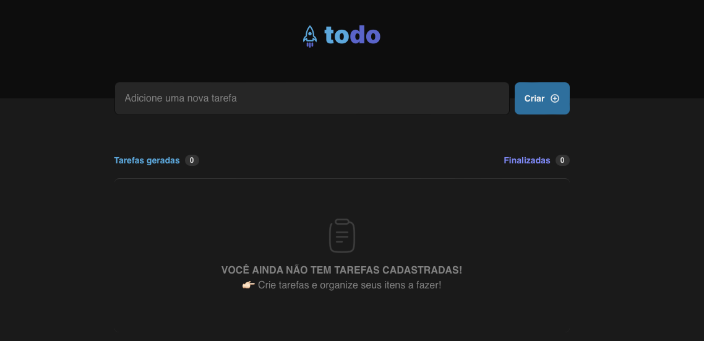
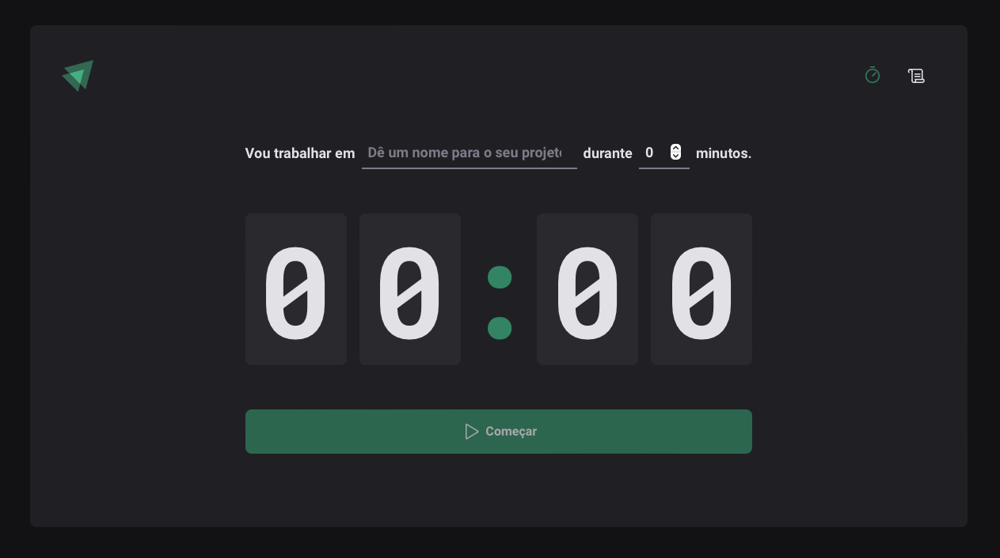
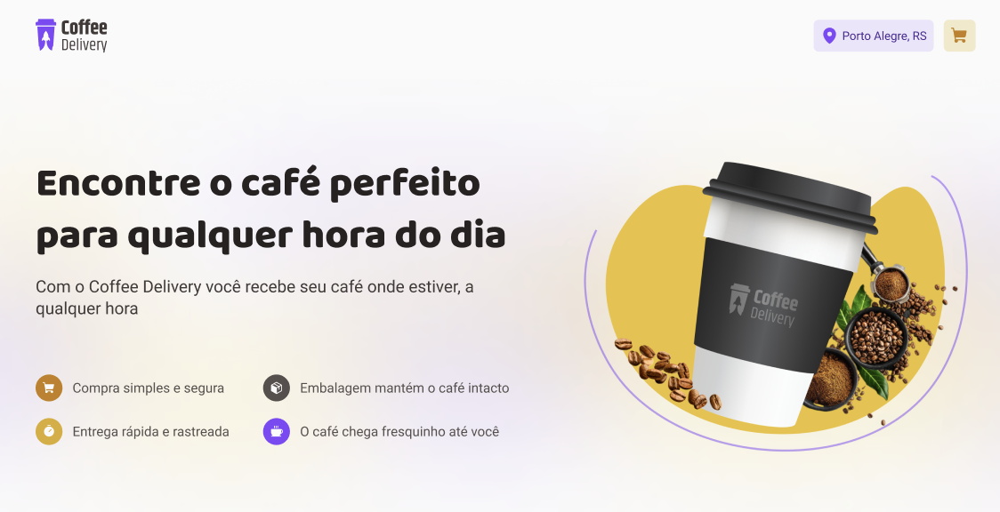

# Desafios e Projetos React 
Repositório criado para armazenar as resoluções dos desafios e projetos que foram desenvolvidos ao longo do estudo aplicado a linguagem ReactJS e também cada projeto, terá seu link de deploy para que possam ser acessados pela comunidade.

&nbsp;

## Desafio 01 - ToDo List

- Neste desafio foi desenvolvido uma aplicação de controle de tarefas no estilo to-do list,  onde no caso seria possível  
adicionar e remover itens de uma listagem, com intuito de ajudar na produtividade do usuário.

### 🛠️ Ferramentas utilizadas no projeto
- Vite
- TypeScript
- CSS Modules

### 📚 Conceitos utilizados no projeto:
- Estados
- Imutabilidade do estado
- Listas e chaves no ReactJS
- Propriedades
- Componentização

&nbsp;

&nbsp;

## Desafio 02 - Pomodoro Timer

- Neste desafio foi desenvolvido uma aplicação para realizar um efeito estilo pomodoro, ao qual o usuário seguirá a temática de tarefa vs. recompensa, com intuito de ajudar na produtividade no final do processo.

### 🛠️ Ferramentas utilizadas no projeto
- Vite
- Typescript
- Styled Components
- React Router Dom
- React Hook Form
- Validações de formulário com Zod

&nbsp;

&nbsp;

## Desafio 03 - Carrinho de compras de um Cafeteria

- Neste desafio foi desenvolvido uma aplicação para gerenciar um carrinho de compras de uma cafeteria fictícia.

### 🛠️ Ferramentas utilizadas no projeto
- Vite
- Typescript
- Styled Components
- React Router Dom
- React Hook Form
- Validações de formulário com Zod

### 📚 Conceitos utilizados no projeto:
- Estados
- ContextAPI
- LocalStorage
- Imutabilidade do estado
- Listas e chaves no ReactJS
- Propriedades
- Componentização

- De maneira complementar, para realizar o cálculo do valor total do carrinho de compras,  
foi pesquisado e aplicado o método reduce para manipulação de arrays.

&nbsp;

&nbsp;
